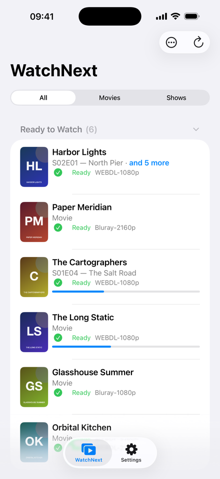
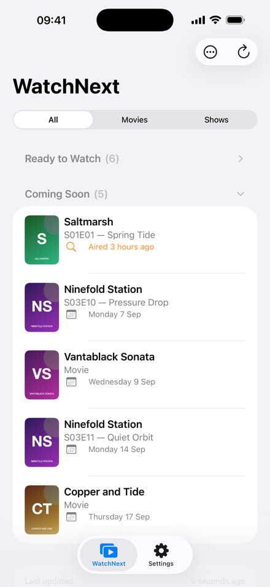
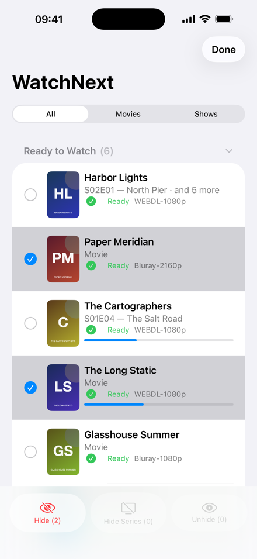
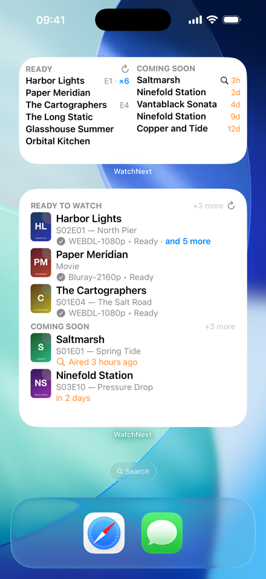

# WatchNext

**What's ready to watch on your own server, at a glance.**

WatchNext is a native iOS app and Home Screen widget for people who run [Jellyfin](https://jellyfin.org), [Sonarr](https://sonarr.tv) and [Radarr](https://radarr.video). It reads the three and answers two questions: what was imported recently that you haven't watched yet, and what is coming next. Nothing else: no management, no playback, read-only against your servers.

Free and open source under the MIT license. No accounts, no analytics, no ads. Your server addresses stay on your device and your keys stay in the Keychain.

<p>
  
  
  
  
  
</p>

*Screenshots show a fictional library from the bundled demo server.*

## Features

- **Ready to Watch**: everything Sonarr and Radarr imported recently that Jellyfin hasn't seen you finish. A whole new season folds into its first unwatched episode with an "and N more" count.
- **Coming Soon**: monitored episodes and movies with their release date, and a magnifier on anything that has aired but isn't downloaded yet.
- **Widgets that fit**: small, medium and large, text-first so more fits. Per-widget density (Comfortable, Compact, Smart), Movies or Shows only, optional posters, optional header-less layout. Refresh from the widget.
- **Curation**: hide a title or a whole series, one at a time or many at once, filter by kind, collapse sections, choose how far back and how far ahead the feed looks, or remove the limits.
- **Diagnostics**: an in-app log with every request and failure, credentials never included.
- **Demo mode**: a fictional library to explore the app and widgets before pointing them at your servers.

## Requirements

- iOS 18 or later
- Sonarr v3, Radarr v3 and a Jellyfin server reachable from your iPhone
- To build: Xcode 26 or later (Swift 6 strict concurrency)

## Try it without servers

Turn on **Settings › Demo › Demo mode**, or tap **Try with sample data** on the first-run screen. The app and its widgets then show a fictional library with every state WatchNext knows: a freshly imported season, a half-watched movie, an episode that aired but is still missing, releases days away. Server settings are kept and used again when the switch is off.

For development, `AppStore/DemoServer/demo_server.py` fakes all three services over HTTP with the same catalog and generated posters:

```sh
python3 AppStore/DemoServer/demo_server.py --ports 8989,7878,8096
```

Then point the app at `http://127.0.0.1:8989`, `http://127.0.0.1:7878` and `http://127.0.0.1:8096` in a simulator; any API key works, Jellyfin accepts any sign-in, pick the user **Demo**.

## Support the project

WatchNext is a spare-time project. If it saves you a trip to three web UIs every evening, you can sponsor it through the button at the top of this page. Bug reports and pull requests are just as welcome: see [CONTRIBUTING.md](CONTRIBUTING.md) and [SUPPORT.md](SUPPORT.md).

## Privacy

See [PRIVACY.md](PRIVACY.md). Short version: the app talks only to the servers you configure and sends nothing anywhere else.

## Identifiers

The checked-in identifiers belong to the App Store build. To sign your own build, replace them with identifiers registered to your team:

- App: `com.mxfapps.WatchNext`
- Widget: `com.mxfapps.WatchNext.Widget`
- App Group: `group.com.mxfapps.WatchNext`
- Shared Keychain group suffix: `com.mxfapps.WatchNext.shared`

Update them consistently in the Xcode project, both entitlement files, both Info.plists, and `WatchNextConstants.swift`, then set your team under Signing & Capabilities for both targets.

## Architecture

Open `WatchNext.xcworkspace`, not the app project directly. The workspace contains
the `WatchNext.xcodeproj` app project and each local Swift package as a separate
workspace member.

`WatchNextLogging` is a local Swift package with no dependency on the rest of the
app. It provides `WatchNextLogger`, a `Sendable` logging facade: synchronous,
`nonisolated` log calls feed one ordered `AsyncStream`, a single consumer assigns
sequence numbers, keeps an in-memory history, and forwards to Unified Logging.
The global minimum level is guarded by a `Mutex`. `WatchNextCore`, the app, and
the widget all depend on it.

`WatchNextCore` is a local Swift package (depending on `WatchNextLogging`) containing:

- normalized media/feed models
- protocol-backed `SonarrClient`, `RadarrClient`, and `JellyfinClient`
- provider-ID-first `MediaMatcher`
- `WatchNextFeedBuilder` filtering and sorting
- `HiddenItemStore` and the `WatchNextFeed` hiding/kind-filter helpers used by app and widget
- App Group settings, feed cache, and artwork cache
- an async CRUD `KeychainVault` facade and a domain-level credential store
- the refresh/source-loading orchestration used by both app and widget

The app is SwiftUI. It owns configuration, diagnostics (Settings → Diagnostics shows
the in-process log history, the minimum log level, credential status, and the last
refresh error), and a full feed view. Each process keeps its own log history, so
widget logs appear only in Console.app, not in the app's Diagnostics screen. The WidgetKit extension reads the same cached feed and credentials, can refresh directly, and never clears good cached content when a refresh fails.

## API behavior

All requests are read-only except Jellyfin authentication, which creates a session token. The clients currently use:

- Sonarr v3: system status, imported history, and calendar
- Radarr v3: system status, imported history, and calendar
- Jellyfin: authentication, users, system info, and user-scoped items/UserData

DTOs intentionally decode only the fields WatchNext needs, so unrelated server-side changes do not break parsing. Use the Settings connection tests against your installed versions and add captured, sanitized fixtures under `Packages/WatchNextCore/Tests/WatchNextTests/Fixtures` if a server response differs.

## Xcode capabilities and signing

For both `WatchNext` and `WatchNextWidget`:

1. Select your Apple Developer team.
2. Replace the placeholder bundle identifiers.
3. Enable **App Groups** with one shared group and update `WatchNextConstants.appGroupIdentifier`.
4. Enable **Keychain Sharing** with one shared access group.
5. Keep the app-group and Keychain values identical between both targets.

The entitlements are in:

- `WatchNext/WatchNext.entitlements`
- `WatchNextWidget/WatchNextWidget.entitlements`

The Info plists use the narrow local-network ATS allowance:

```xml
<key>NSAppTransportSecurity</key>
<dict>
    <key>NSAllowsLocalNetworking</key>
    <true/>
</dict>
```

They also include `NSLocalNetworkUsageDescription`. There is no global `NSAllowsArbitraryLoads` exception. Base URLs are stored as non-sensitive App Group settings, so moving to HTTPS/local DNS later only requires changing Settings.

## Configure services

Open the app's **Settings** tab.

1. Enter the Sonarr base URL and an API key, then use **Test Connection**.
2. Enter the Radarr base URL and an API key, then use **Test Connection**.
3. Enter the Jellyfin base URL and either:
   - sign in with username/password (the password is not stored; the returned access token is), or
   - enter an API token and use **Test Token**.
4. Select the Jellyfin user whose watched state should drive the feed.
5. Adjust the two feed windows if desired, then tap **Save**. *Recent imports* bounds Ready to Watch: media imported by Sonarr or Radarr within that many days and not yet watched in Jellyfin. *Coming soon* bounds Coming Soon: monitored releases within that many days. Step either down to 0 to remove its limit; unlimited Coming Soon looks a year ahead, and unlimited Ready to Watch is bounded only by the newest 250 imports per service.
6. Return to **WatchNext** and pull to refresh.

## Coming Soon and missing downloads

Coming Soon lists monitored releases with a date ahead. Once the date passes and nothing has been imported yet, the item stays there marked with a magnifier and "Aired 2 hours ago" (or "Released"), in the app and in widgets, for as long as the recent-imports window allows. It moves to Ready to Watch when Sonarr or Radarr import it and Jellyfin sees it.

## Curate the feed

- **Movies / Shows / All** segmented control at the top narrows the feed. The choice is remembered on this device.
- **Ready to Watch** and **Coming Soon** headers show how many rows they list under the current filter and collapse when tapped. Each section remembers its state across launches.
- Ready episodes of the same series and season fold into their earliest episode with an "and N more" suffix, in the app and the widget. A whole imported season is one row; hiding that episode surfaces the next one. Coming Soon stays one row per episode since each has its own date. The cache keeps every episode, so nothing is lost.
- Swipe left or long-press a row to **Hide** it. Episodes also offer **Hide Series**, which removes every ready and upcoming episode of that show.
- **Options → Show Hidden** reveals a Hidden section at the bottom of the feed; swipe or long-press there to **Unhide**.
- **Options → Select Items** turns on multi-select. Pick any rows, including hidden ones, and use **Hide**, **Hide Series**, or **Unhide** in the bar at the bottom; each shows how many selected rows it applies to.
- Hidden entries live in the App Group, so the widget honors them too. After every successful refresh the list is pruned to entries that still match something in the feed, so it never accumulates media that was watched or removed. A hidden series is therefore forgotten once it has no episodes in the feed, and shows up again with its next season.

API keys, usernames, and Jellyfin tokens are stored only in Keychain. Passwords exist only in the in-memory sign-in form and are cleared after a successful sign-in.

## Add the widget

After installing and opening WatchNext once:

1. Long-press the Home Screen.
2. Add a widget and search for **WatchNext**.
3. Choose small, medium, or large.

Long-press a placed widget and choose **Edit Widget** to configure it:

- **Density**: *Comfortable* (three lines per item), *Compact* (two lines), or *Smart* (default), which tries the layout that lists the most items and, for that count, the most comfortable row style. Rows shrink to one line when that fits more media.
- **Content**: *All* (default), *Movies*, or *Shows*. Narrows that widget to one kind, independently of the app's own segmented control, so one widget can list movies and another shows.
- **Show Artwork**: posters in the large widget's comfortable layout. Small and medium widgets never show artwork; they spend the space on more rows.
- **Section Titles** (small and large): off replaces the section titles with a divider that carries both overflow counts ("↑ +N more" in green for ready, "+N more ↓" in orange for upcoming), fitting more items. The refresh button sits in the middle of that divider.

Small and medium rows use short hints: episode codes without the season ("E20"), compact times ("1h", "6d"), and margins of 11 points. A dense row keeps its full title when it fits, otherwise it drops the episode code before truncating; the folded-season count and an upcoming row's time always stay. A folded season shows as a multiplier ("E01 ×6", six episodes), distinct from the "+N more" overflow counts. Upcoming times are tinted orange.

Upcoming items show a relative time ("in 2 days", "in 5 hours" in large; "2d", "5h" in small and medium). The refresh button sits on the first section's title line.

WidgetKit controls refresh scheduling. WatchNext requests a new timeline after roughly 30 minutes, but iOS may coalesce or delay it. The refresh button attempts an immediate refresh and reloads the timeline. If the server is unreachable, the widget keeps the last successful feed and displays a subtle stale indicator.

## Development

Open `WatchNext.xcworkspace`. Set your team under **Signing & Capabilities** for both targets; the repository ships without one. The simulator needs no team.

### Tests

From `WatchNext.xcworkspace`, select the `WatchNextCore` or `WatchNextLogging`
package scheme to build or test a package independently from the app. Xcode
synthesizes these schemes from each `Package.swift`.

Run the package tests with:

```sh
cd Packages/WatchNextLogging && swift test
cd Packages/WatchNextCore && swift test
```

The `WatchNextTests` target covers movie/series/episode matching, watched filtering, recent and future windows, sorting, duplicate elimination, and stale-cache preservation.

## Known limitations

- Import history is capped at the newest 250 imported records per service per refresh.
- Jellyfin library loading currently uses a high single-page limit rather than pagination.
- Queue/download models are reserved in the normalized model, but queue endpoint integration is not enabled in v1.
- Artwork downloads are best-effort and cached; missing or protected upstream artwork falls back to a native placeholder.
- Widget refresh timing remains under WidgetKit control.
- iOS 26.5 does not decode `AppEnum` widget parameters (the extension receives the default; iOS 26.4 decodes them correctly). The Density and Show settings are therefore String parameters backed by `DynamicOptionsProvider`s, mapped to `RowDensity` and `FeedKindFilter` in the timeline provider.

## Notification next steps

Notifications should remain independent of widget refreshes. A concrete next increment is:

1. Add an authenticated, self-hosted webhook receiver or ntfy topic reachable by Sonarr/Radarr.
2. Configure Sonarr **On Import Complete** and Radarr **On Import Complete** connections to publish a minimal event without API keys or media-server credentials.
3. Have that service send APNs notifications through a small server component, or use the ntfy iOS client first.
4. Add an optional notification settings model in WatchNext and deep-link notifications to the feed.
5. Treat the push as a hint: refresh from Sonarr/Radarr/Jellyfin on receipt and keep the shared cache as the source shown by the widget.

This avoids exposing an HTTP server from the phone and keeps import webhooks outside the LAN-client architecture.
